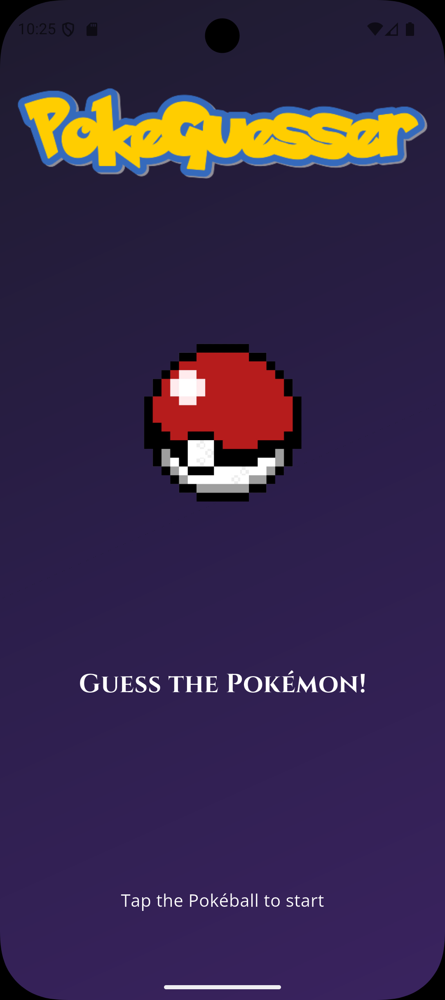
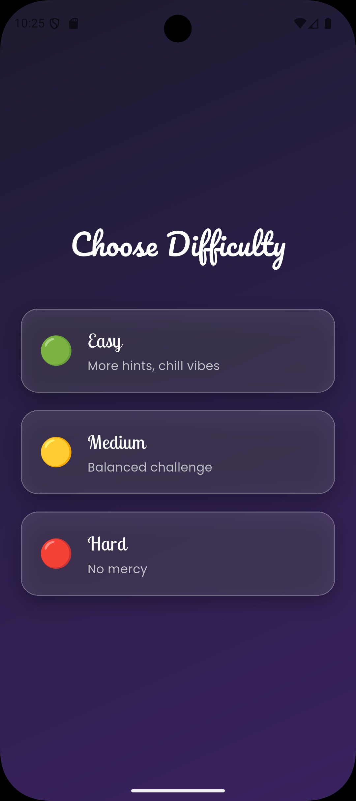
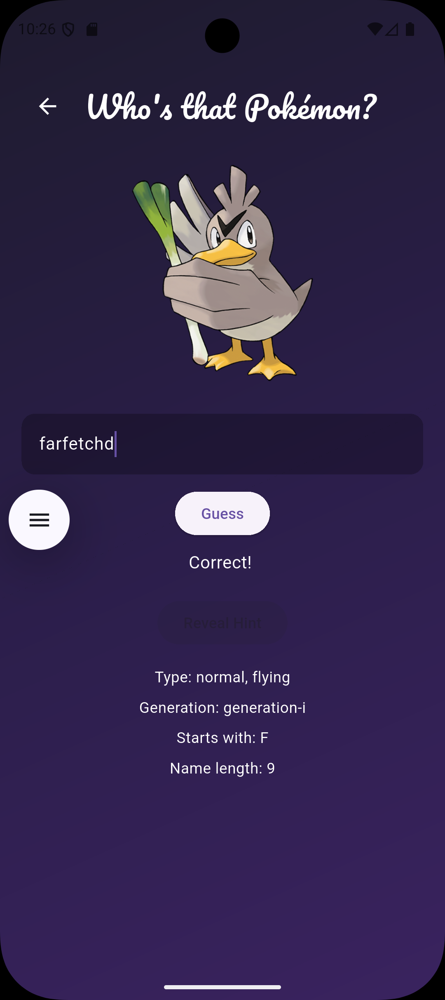

# Pokémon Guessing Game

A Flutter-based Pokémon Guessing Game where players identify Pokémon using visual and textual hints.  
The game supports multiple difficulty levels and progressively reveals hints to challenge the player.

---

## Features

- Difficulty selection (Easy, Medium, Hard)
- Random Pokémon generation
- Darkened Pokémon sprite reveal system
- Progressive hints (type, generation, letters)
- Clean modular Flutter architecture
- State management using Provider

---

## Project Structure

```
lib/
│
├── models/
│ └── pokemon.dart
│
├── pages/
│ ├── homepage.dart
│ │
│ ├── difficulty_select_page.dart
│ │
│ └── game_page.dart
│
├── providers/
│ └── game_provider.dart
│
├── utils/
│ └── api_connector.dart
│
├── widgets/
│
└── main.dart
```

---

## Screenshots

<div align="center">
<table>
  <tr>
    <td align="center">
      <br>
      Homepage
    </td>
    <td align="center">
      <br>
      Difficulty Selection
    </td>
    <td align="center">
      <br>
      Demo 1
    </td>
    <td align="center">
      <br>
      Demo 2
    </td>
  </tr>
</table>
</div>


---

## Game Flow

1. User launches the app and lands on the homepage
2. User selects a difficulty level
3. A random Pokémon is generated
4. The Pokémon sprite is displayed in a darkened form
5. Hints are revealed based on difficulty
6. User guesses the Pokémon name

---

## Tech Stack

- Flutter
- Dart
- Provider

---

## Getting Started

1. Clone the repository
2. Run `flutter pub get`
3. Run the app using `flutter run`

---

## Future Improvements

- Score tracking and leaderboard
- Timed game mode
- Sound effects and animations
- Offline Pokémon dataset
